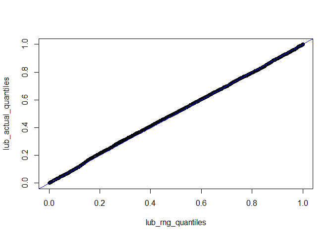

Generating random draws from a truncated Student’s t distribution
================
Antonio R. Vargas

This repo contains code to generate bounded or unbounded draws from a t
distribution in the file `/stan/student_t_rngs.stan`. There are two RNG
functions:

`student_t_alternate_rng(df, mu, sigma)` - This generates draws of the
usual t distribution and is approximately equivalent to Stan’s
`student_t_rng(df, mu, sigma)`.

`student_t_lub_rng(df, mu, sigma, lb, ub)` - This generates draws of the
truncated t distribution with lower bound `lb` and upper bound `ub`.

# Details

The algorithm first generates draws from a normal distribution, then
transforms those into draws for the t distribution via the map
`Q(z) = F_inv(G(z))`, where `G(z)` is the CDF of the standard normal
distribution and `F_inv(p)` is the *inverse* of the CDF of the t
distribution. In other words, if `z` is a draw from the standard normal
distribution, then `Q(z)` is a draw from the t distribution.

To calculate `Q(z)` I implemented a relatively new approximation
developed by Shaw, Luu, and Brickman[^1]. Their paper gave expressions
for the components of the approximation for arbitrary degrees of freedom
`df` and explored the approximation for `df = 4` in detail, but it was
missing one key detail.

The approximation for `Q(z)` consists of two separate pieces: a power
series expansion that is accurate for small `z` and a different
asymptotic series that is accurate for large `z`. In the `df = 4` case
considered in the paper, the authors used the inner approximation when
`|z| < 4` and the outer approximation when `|z| >= 4`, but did not
suggest where to switch between the two approximations for other values
of `df`.

After some experimentation, I found that using the inner approximation
when `|z| < 2*sqrt(df)` and the outer approximation when
`|z| >= 2*sqrt(df)` gave quite accurate results for arbitrary `df > 1`.
This is the branch point I have implemented in the code.

# Accuracy

To gauge the accuracy of the approximation for `Q(z)` I compared it to a
reference calculation in R, `qt(pnorm(z), df)`, over the interval
`|z| < 6`.

For degrees of freedom `df > 1.43`, the maximum relative error of this
implementation is `6.58e-5`. As `df` decreases from `df = 1.43` toward
`df = 1`, the maximum relative error increases roughly monotonically to
`2.11e-4`.

# A Q-Q plot

The file `/stan/test.stan` generates random draws from the truncated t
distribution with lower bound 1, upper bound 6, mean 3, sigma 1, and
degrees of freedom 5. The code below pulls 4000 draws and creates a Q-Q
plot comparing the quantiles of those draws to the quantiles of the
known truncated t distribution.

``` r
library(dplyr)
library(posterior)
library(cmdstanr)

mod <- cmdstan_model("stan/test.stan", compile_model_methods = TRUE)
fit <- mod$sample(fixed_param = TRUE, refresh = 0)
```

    ## Running MCMC with 4 parallel chains...
    ## 
    ## Chain 1 finished in 0.0 seconds.
    ## Chain 2 finished in 0.0 seconds.
    ## Chain 3 finished in 0.0 seconds.
    ## Chain 4 finished in 0.0 seconds.
    ## 
    ## All 4 chains finished successfully.
    ## Mean chain execution time: 0.0 seconds.
    ## Total execution time: 0.5 seconds.

``` r
t_lub_sorted <- 
  fit$draws() %>% 
  as_draws_df() %>% 
  pull(t_lub) %>% 
  sort()

lub_rng_quantiles <- seq_along(t_lub_sorted)/length(t_lub_sorted)
lub_actual_quantiles <- 
  (pt((t_lub_sorted - 3)/1, 5) - pt((1 - 3)/1, 5)) / 
  (pt((6 - 3)/1, 5) - pt((1 - 3)/1, 5))

plot(lub_rng_quantiles, lub_actual_quantiles)
abline(0, 1, col = "blue")
```

<!-- -->

[^1]: Shaw, Luu, and Brickman, *Quantile mechanics II: changes of
    variables in Monte Carlo methods and GPU-optimised normal
    quantiles*. European Journal of Applied Mathematics.
    2014;25(2):177-212.
    [doi:10.1017/S0956792513000417](https://doi.org/10.1017/S0956792513000417);
    [arxiv.org/abs/0901.0638](https://arxiv.org/abs/0901.0638)
